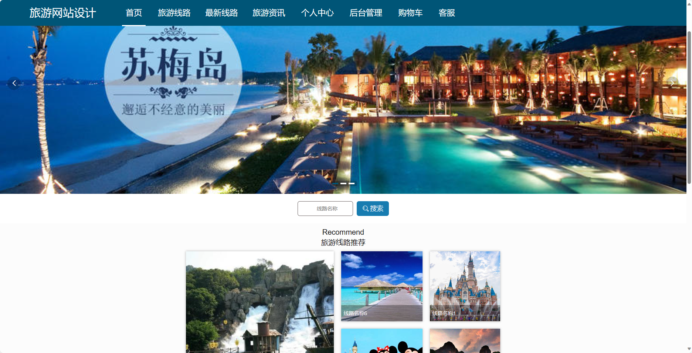
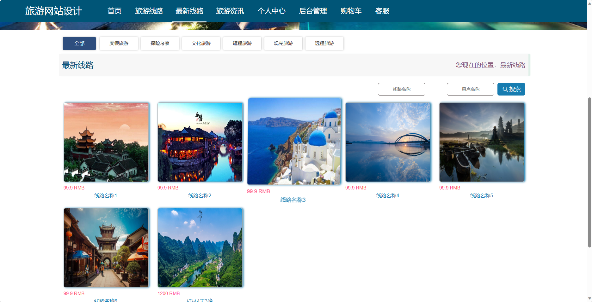
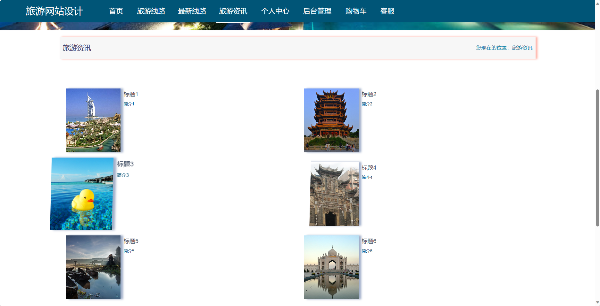
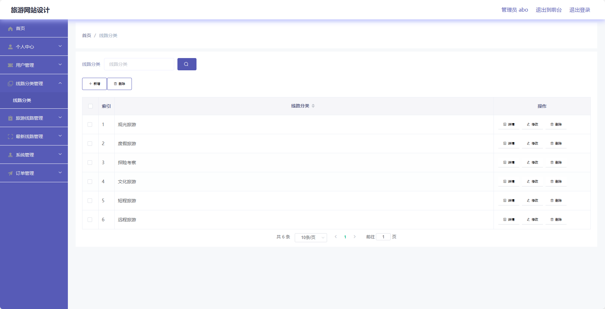

<h1 align="center">基于SpringBoot框架实现的旅游网站【带文档】</h1>

<h4> 完整代码获取地址：从戎源码网（https://armycodes.com/） </h4>
<h4> 作者微信：19941326836 QQ：605739993 QQ群：655392706 </h4>
<h4> 承接计算机毕设、Java毕业设计、Python毕业设计、深度学习、机器学习 </h4>
<h4> 选题+开题报告+任务书+程序定制+安装调试+论文+答辩ppt 一条龙服务 </h4>
<h4> 毕业设计所有选题地址：(https://github.com/Descartes007/allProject) </h4>

## 项目介绍

基于SpringBoot框架实现的旅游网站【带文档】：前端 vue、axios、elementui，后端 springboot、mybatis，系统角色分为：管理员和用户，管理员在管理后台用户信息、线路信息、旅游路线管理等；用户可以查看旅游资讯等。主要功能如下：

## 【前台】：

- 首页：展示旅游网站的核心内容，包括推荐的旅游线路、最新的旅游资讯等。
- 旅游线路：展示各类旅游线路，包括线路名称、线路介绍、价格等信息。
- 最新线路：展示最新发布的旅游线路，方便用户了解最新的旅游信息。
- 旅游资讯：提供最新的旅游资讯、游记分享等内容，方便用户获取旅游相关的信息。
- 个人中心：用户可以在个人中心管理自己的个人信息，包括修改密码、查看订单等。
- 购物车：用户可以将感兴趣的旅游线路加入购物车，方便统一结算。
- 客服：提供在线客服功能，方便用户在遇到问题时进行咨询和反馈。

## 【后台】
### 管理员

- 个人中心：管理员可以查看和编辑个人信息，包括修改密码等。
- 用户管理：管理员可以管理系统的用户账号，包括添加、编辑和删除用户。
- 线路分类管理：管理员可以管理旅游线路的分类，包括添加、编辑和删除分类。
- 旅游线路管理：管理员可以管理旅游线路的信息，包括添加、编辑和删除线路。
- 最新线路管理：管理员可以管理最新发布的旅游线路，包括添加、编辑和删除最新线路。
- 系统管理：管理员可以管理系统的其他配置信息，包括网站公告、参数设置等。
- 订单管理：管理员可以查看和处理用户的订单，包括确认订单、取消订单等操作。

### 用户

- 个人中心：用户可以查看和编辑个人信息，包括修改密码等。
- 我的收藏管理：用户可以管理自己收藏的旅游线路信息，包括查看收藏、取消收藏等操作。
- 订单管理：用户可以查看和管理自己的订单，包括查看订单详情、取消订单等操作。

## 环境

- <b>IntelliJ IDEA 2020.3</b>

- <b>Mysql 5.7.26</b>

- <b>Maven 3.6.3</b>

- <b>JDK 1.8</b>

## 运行截图

